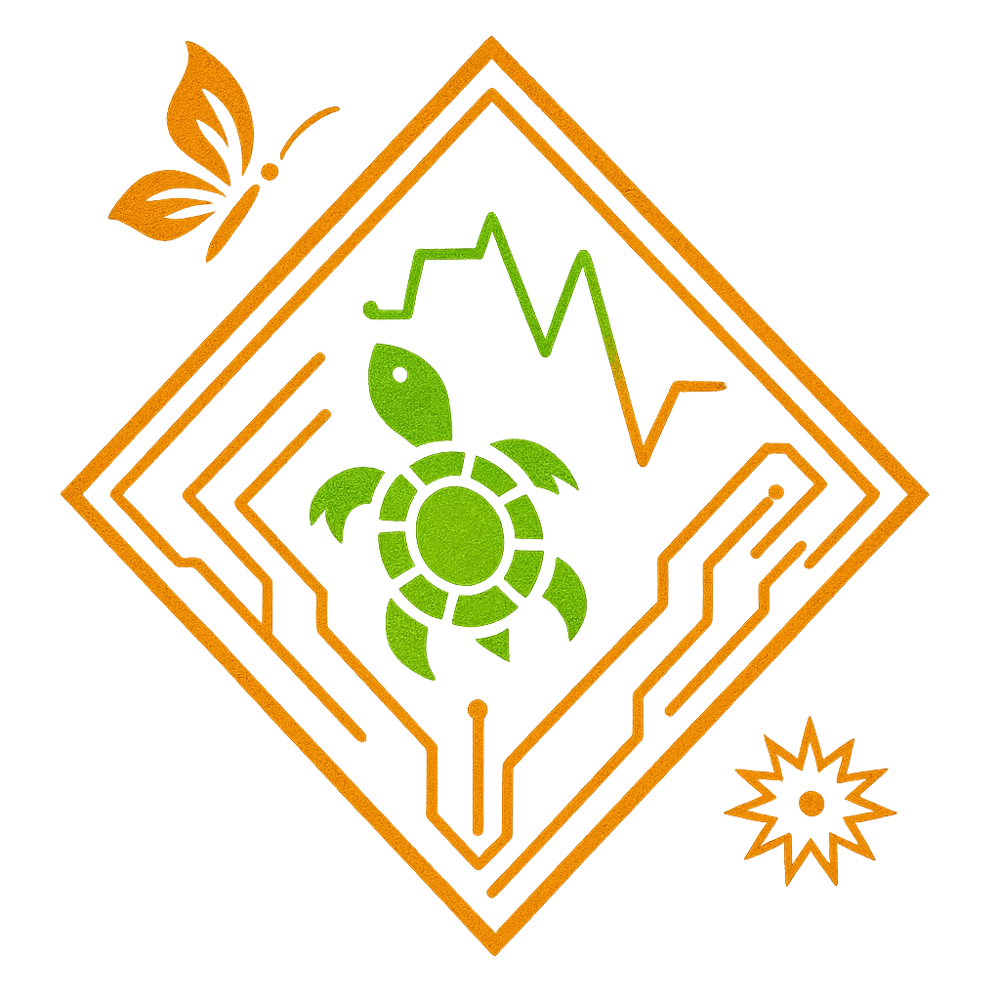

## README: Purpose and Philosophy

### Project Title

**Aeroscale Flight AI Lab**

### Actor Types

These are the operational beings within the ecosystem—each behaving like natural analogues, contributing to mutual survival:

* **Aerospace Actors (The Flyers)**

  * Role: Swift, intelligent, adaptive. These are the aircraft and drones—agile gatherers and pollinators of data, action, and influence.
  * Analogy: Like bees in a living field, they extract, observe, and defend through rapid motion and instinct.

* **Ship Actors (The Anchors)**

  * Role: Grounding and nourishing the ecosystem. These are the ships—providing command, resupply, memory storage, and defense.
  * Analogy: Like flowers and roots, they remain central and still, letting the ecosystem revolve around their resilience and support.

### Summary

Aeroscale Flight AI Lab is a tactical system design initiative rooted in ecological principles, indigenous strategy, and symbiotic AI behavior. This lab explores flight combat as a living system, integrating adaptive technologies with survivability logic based on natural ecosystems.

### Core Mission

To develop an aerospace framework that behaves like a sustainable, self-adjusting organism—prioritizing resilience, adaptability, and survival over brute force or static command hierarchies.

### Key Concepts

* **Ecosystem-Inspired Warfare**: Combat modeled after biological systems—bees, roots, pollen, habitats.
* **Reflexive AI Protocols**: Units act instinctually rather than following rigid command.
* **Attrition-Aware Design**: Every loss is absorbed by rebalancing the whole system.
* **Human Integration**: Pilots and operators are seen as roles in an ecosystem, not just command actors.

### Technologies & Behaviors

* Gatherers, Pollinators, Feeders, Roots
* Ship-to-air synchronization
* Signal sustainability networks
* Reflex-trees (upcoming)

### Cultural Philosophy

Influenced by Biafran ingenuity, Benin architecture, and Igbo systems of continuity. This lab embraces indigenous logic as technological wisdom—memory as defense, adaptability as survival.

---

### Neurodivergent Problem Logic – A Layered Model of Access

In typical systems:

* **Standard user logic** goes **A → B → C** — input, process, output.
* Problem solved, straightforward.

In neurodivergent logic:

* Path may go **A → B → A → B → A** — looping due to mismatch with the system’s expectations.
* Then an attempt is made to brute-force it **A → C** — skipping expected logic steps to find relief or function.
* Then re-routing again **A → → C**, via alternative cognition or sensory feature paths—like visual cues, symbol keys, audio tones—essential accessibility layers that aren't luxury, but survival.

This is like approaching a vending machine with no color keys, no text, no affordances. If you're not autistic or ADHD, you see a row of snacks. If you are, you see a logic wall—unless someone took time to embed features that let your mind map it.

In OBINexus, these cognitive routes aren't dismissed—they're mapped, honored, and built into how protocol gates behave. The ecosystem isn't one solution for all—it’s a living web of layered access, because **everyone deserves an entry point**.

---

### OBINexus Tactical Defense Assembly (TDA) – Division Charter

**Branch Title**: Ọrụ Ichekwa Ncheta (Defense of Memory & Sovereignty)
**Cultural Call Sign**: Benin-Biafra Guardworks

#### 🛡 Purpose

To design defense architectures that reflect cultural sovereignty, survivability, and strategic remembrance. TDA links indigenous warcraft to modern protocol engineering.

#### 📍 Clear Divisional Structure

* **Aerospace Division**

  * Pilots, AI flight systems, reflex swarm architecture
  * Role: Mobility, intelligence dispersal, attrition mapping
  * Command: Air-Tier Coordinator (ATC)

* **Naval Division**

  * Colossus-class ships, command hubs, habitat logistics
  * Role: Anchoring, replenishment, comms relay
  * Command: Sea-Tier Commander (STC)

* **Coordination Nexus**

  * Ensures both divisions operate under mutual protocol harmony
  * Reflex escalation, AI-piloted fallback strategies, emergency override pathways
  * Command: Nexus Logic Overseer (NLO)

### System Philosophy

* **No Division Acts Alone**: Every unit operates within the ecosystem—air supports sea, sea sustains air.
* **Defend What Remembers**: The system protects cultural code, not just compute nodes.
* **Collapse Resilience**: In extreme attrition, fallback AI reconfigures ecosystem roles autonomously.

### OBINexus Branch Declaration

With the formation of the OBINexus Tactical Defense Assembly (TDA), a new official branch of OBINexus is born. This division stands as a sovereign computational bastion of memory, reflex, and rooted defense. TDA is both a philosophical and infrastructural entity—responsible for crafting the symbiotic balance between flight and foundation.

### Goals

* AI that understands “why” it defends
* Protocols that reinforce mutual care across division lines
* Embodied indigenous design in high-tech architectures

### Motto

"To Evolve is to Endure." 🌿

*Alternate Cultural Inscription (Igbo Context):*
**"Ọnwụ adịghị onye chetara."** — "Death does not reach the one who remembers."

This inscription reflects the Igbo reverence for memory, survival, and legacy—making the motto not just tactical, but ancestral.

---

### 🛡 OBINexus TDA Emblem

\[...unchanged section here for brevity...]

---

### 🎭 Global Defense Protocol Models: OBINexus TDA vs. Black Budget Logic

| **Aspect**               | **OBINexus TDA**                                            | **Black Budget Defense Sector**                                     |
| ------------------------ | ----------------------------------------------------------- | ------------------------------------------------------------------- |
| **Resource Philosophy**  | Distributed, ecosystem-fed, survival-scaled                 | Unlimited allocation, centralized, brute-force funded               |
| **Operational Ethic**    | Cultural sovereignty, symbiosis, respect for memory         | Secrecy-first, denial-based, profit or dominance-centric            |
| **Command Structure**    | Reflex-based roles, decentralized AI-human trust lattice    | Executive-locked top-down hierarchy with classified layers          |
| **Budget Source**        | Transparent contribution, cooperative modeling              | Untraceable black funds, often tied to executive elite directives   |
| **Engagement Logic**     | Sustainability-first, battle returns to survival            | Terminal action first—destroy, then ask questions                   |
| **Technology Symbolism** | Turtle + Butterfly (defense and return)                     | Shadow Systems (classified tech with no citizen audit trail)        |
| **Community Identity**   | Belonging, role feedback, earned through ecological harmony | Outsourced authority—detached operators in isolated command bubbles |

> “You don’t need a bottomless budget to protect what remembers—just a system that knows why it’s alive.”
